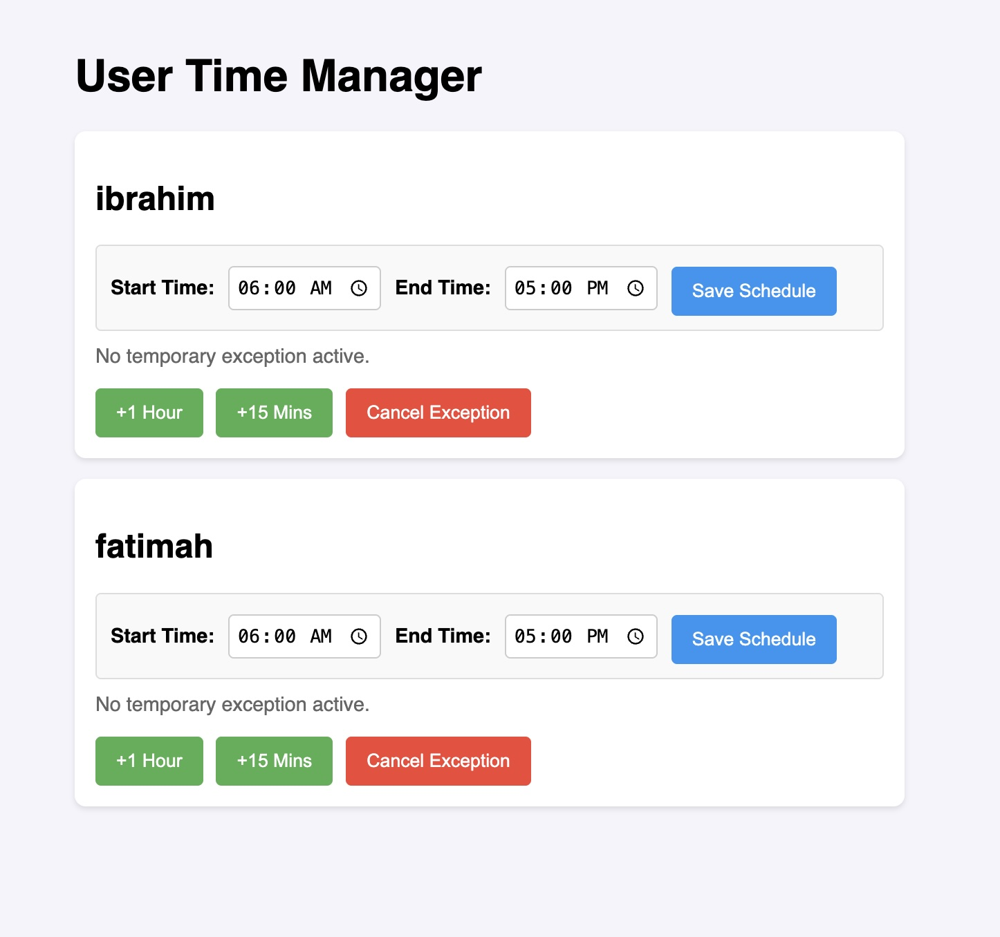

# 🐧 Linux Family Time Manager

**Linux Family Time Manager** is a robust, zero-configuration parental control and screen-time management solution built exclusively for Linux desktop environments (Ubuntu, Linux Mint, Debian, Arch, etc.).

Designed as an open-source alternative to proprietary solutions like *Microsoft Family Safety* or *Google Family Link*, this tool gives parents complete, airtight control over when their children can log in, while offering the flexibility of a mobile-friendly web dashboard to grant remote exceptions on the fly.



## 🌟 Key Features

*   🛡️ **Airtight PAM Enforcement:** Integrates directly into Linux's Pluggable Authentication Modules (`pam_exec.so`). It blocks logins at the system level before the desktop environment even loads.
*   🧹 **Active Session Sweeping:** Automatically kicks users out if they are actively playing a game or watching a video when their allowed time window expires.
*   🔒 **Secure 2FA Authorization:** No more shared passwords. All time extensions and schedule changes require a 6-digit TOTP code from your phone (Google Authenticator, Authy, etc.).
*   📱 **Remote Web Dashboard:** A mobile-friendly Flask web portal allows parents to grant bonus time (e.g., "+1 Hour" or "+15 Mins") instantly.
*   ⏱️ **Dynamic Schedule Management:** Set permanent start and end times for each user directly from the web UI.
*   🛑 **BIOS Cheat Prevention:** Forces the GUI (LightDM/GDM) to wait for a verified Network Time Protocol (NTP) sync before allowing logins, preventing bypasses via hardware clock modification.

## 🏗️ Multi-Layer Security Architecture

1.  **The Database:** Centralized truth at `/etc/user-time-manager/config.json`. Hardened with `0644` permissions so only root can modify it.
2.  **The 2FA Gatekeeper:** `credentials.json` (protected `0600`) stores a unique TOTP secret. The API requires a valid time-synced code for any state-changing operation.
3.  **One-Time Enrollment:** A secure first-run flow ensures the QR code is only seen once by the administrator during setup, then permanently hidden.
4.  **The Front Door:** `pam_check.py` evaluates all login attempts against the schedule and active exceptions.
5.  **The Enforcer:** A background cron job (`sweep.sh`) runs every 5 minutes, warning users via desktop notifications before terminating expired sessions via `loginctl`.

## 🚀 Quick Start

### 1. Installation
```bash
git clone https://github.com/ibnYusrat/linux-family-time-manager.git
cd linux-family-time-manager
sudo ./install.sh
```

### 2. Secure Enrollment
1.  Navigate to `http://your-ip:5000`.
2.  You will be prompted to scan a **QR Code**.
3.  Scan it with your preferred Authenticator app.
4.  Enter the 6-digit code to link your phone.
5.  **Important:** The QR code will never be shown again after this step.

### 3. Usage
*   **Schedules:** Use the time pickers to set the allowed window.
*   **Bonus Time:** Tap "+1 Hour" to grant temporary access.
*   **Authorization:** Every change will pop up a request for your 6-digit 2FA code.

## 🛠️ Requirements & Tech Stack
*   **OS:** Ubuntu 22.04+, Linux Mint 21+, Debian 12+, Arch Linux
*   **Backend:** Python 3, Flask, PyOTP
*   **System Integration:** systemd, PAM (`pam_exec`), cron, loginctl, DBus

---
*Keywords: Linux Parental Controls, Ubuntu Screen Time, Linux Mint Family Safety, Google Family Link Alternative, 2FA Parental Lock, PAM login restriction.*
